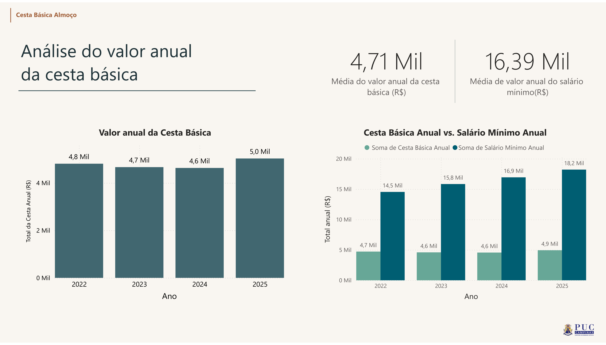
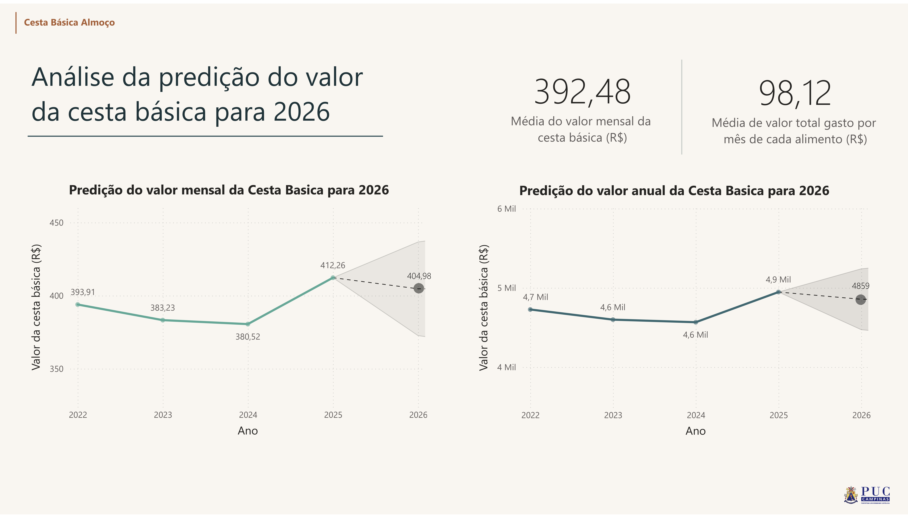
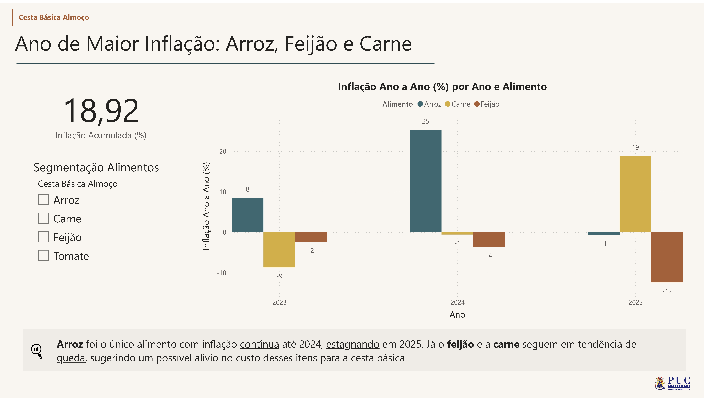

# 🛒 Análise e Predição de Preços: Cesta Básica

Este projeto apresenta uma análise profunda sobre a variação de preços dos itens da cesta básica, utilizando **Power BI** para visualização de dados e modelos estatísticos para **predição de tendências (Forecasting)**. O objetivo é fornecer insights sobre a inflação alimentar e o impacto no poder de compra.

---

## 🚀 Funcionalidades e Dashboards

O projeto é dividido em visões estratégicas:

* **Análise Temporal:** Evolução dos preços ao longo dos meses/anos.
* **Dashboard de Inflação:** Comparativo percentual de aumento por categoria de produto.
* **Projeções (Forecasting):** Modelagem preditiva para estimar os preços nos próximos meses com base em dados históricos.
* **Filtros Dinâmicos:** Segmentação por produto, período e região.

---

## 🧠 Metodologia e Ferramentas

Para garantir a precisão dos insights, o projeto seguiu as seguintes etapas:

* **ETL (Extract, Transform, Load):** Limpeza e tratamento de dados brutos utilizando Power Query (M Language).
* **Modelagem de Dados:** Criação de tabelas dimensão e fato (Star Schema) para otimizar a performance dos filtros.
* **DAX (Data Analysis Expressions):** Desenvolvimento de métricas customizadas para cálculo de variação acumulada e médias móveis.
* **Visualização:** Design focado em UX (User Experience) para facilitar a leitura de KPIs críticos.

---

## 📈 Demonstração dos Resultados

| Visão de Predição | Evolução da Inflação |
| :---: | :---: |
|  |  |

---

## 📂 Como visualizar o projeto

1.  Acesse a pasta `docs/` para ler o **Relatório Técnico Completo (PDF)**.
2.  Baixe o arquivo `projeto-cesta-basica.pbix` na raiz.
3.  Abra o arquivo utilizando o **Power BI Desktop**.

---

## 🎓 Autor
Desenvolvido por **Ítalo Botelho** e colegas como parte de projetos de extensão em **Ciência de Dados e IA**.
